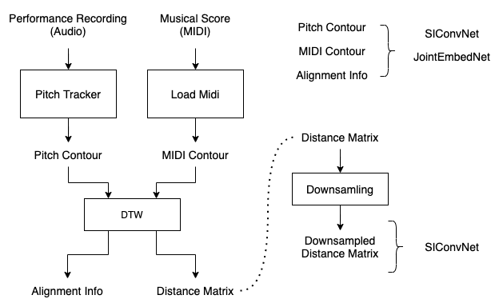

# data_processing

This file explains the data folder structure and the steps we used to compute the files (.dill, .h5).

Note that the audio and pitch contour are not publicly available. 
Therefore you cannot reproduce the results using the original data. 
If you want to adapt the code to your data, this document might be helpful.

Acronyms: PC (or pc) = pitch contour, SC (or sc) = score



Data folder structure:
```
.
└───MIG-FbaData
└───saved_dill
        # pc files
    └───middle_2_pc_6.dill
    └───symphonic_2_pc_6.dill
└───split_dill
        # pc split files
    └───middle_2_pc_6_train.dill
    └───middle_2_pc_6_valid.dill
    └───middle_2_pc_6_test.dill
    └───symphonic_2_pc_6_train.dill
    └───...
└───fall19/data
    └───midi
            # sc files
        └───middle_2_midi_res12_6.dill
        └───symphonic_2_midi_res12_6.dill
            # sc files with alignment info
        └───middle_2_midi_aligned_s_6.dill
        └───symphonic_2_midi_aligned_s_6.dill
    └───matrix
            # raw matrices
        └───middle_2_matrix_6.h5
        └───middle_id2idx_6.dill
        └───symphonic_2_matrix_6.h5
        └───symphonic_id2idx_6.dill
            # matrices at different resolutions
        └───middle_matrix_train{dim}.dill
        └───middle_matrix_valid{dim}.dill
        └───middle_matrix_test{dim}.dill
        └───symphonic_matrix_train{dim}.dill
        └───...
```

## MIG-FbaData

Pull this repo: https://github.com/GTCMT/MIG-FbaData

Again the audio and pitch contour are not publicly available. 
You will not be able to access the OneDrive Link in the instruction there.

## data_process.py

Load audio and assessment ratings according to the FBA folder structure.
It generates the following files:
```
# performance (pc files)
saved_dill/middle_2_pc_6.dill
saved_dill/symphonic_2_pc_6.dill

# midi (sc files)
fall19/data/midi/middle_2_midi_res12_6.dill
fall19/data/midi/symphonic_2_midi_res12_6.dill
```

__pc file__: a list of dictionaries. Each dictionary contains all information needed for one performance 
(year, instrument, student_id, audio (optional), pitch contour, ratings)

__sc file__: a dictionary of dictionaries. The score for a specific year and a specific instrument can by retrieved 
by SC\[instrument\]\[year\], in pianoroll format. 

## data_matrix.py

Compute distance matrices and apply DTW for all (pc, sc) pairs. 
This is to generate the input to SIConvNet and JointEmbedNet.
It generates the following files:

```
fall19/data/matrix/middle_2_6_matrix.h5
fall19/data/matrix/middle_id2idx_6.dill

fall19/data/matrix/symphonic_2_6_matrix.h5
fall19/data/matrix/symphonic_id2idx_6.dill

(fall19/data/matrix/many_tmp_files...)

fall19/data/midi/middle_2_midi_aligned_s_6.dill
fall19/data/midi/symphonic_2_midi_aligned_s_6.dill
```

__h5 file__: Raw matrices for each pair (pc, sc).

__id2idx__: Map (year, student_id) to the index in .h5 file.

__midi_aligned_s__: Combine the sc files with the alignment info from DTW.

## data_split.py

Generate data splits:

```
split_dill/middle_2_pc_6_train.dill
split_dill/middle_2_pc_6_valid.dill
split_dill/middle_2_pc_6_test.dill

split_dill/symphonic_2_pc_6_train.dill
split_dill/symphonic_2_pc_6_valid.dill
split_dill/symphonic_2_pc_6_test.dill
```

They share the same structure as the pc files in `saved_dill`.

## data_matrix_resize.py

Read the distance matrices saved in the h5 file, and resample/resize to the desired resolution (input to DistMatNet)

```
fall19/data/matrix/middle_matrix_train{dim}.dill
fall19/data/matrix/middle_matrix_valid{dim}.dill
fall19/data/matrix/middle_matrix_test{dim}.dill

fall19/data/matrix/symphonic_matrix_train{dim}.dill
fall19/data/matrix/symphonic_matrix_valid{dim}.dill
fall19/data/matrix/symphonic_matrix_test{dim}.dill
```

They share the same structure as the pc files in `saved_dill`.

# Usage

## SIConvNet and JointEmbedNet

The following code snippet is taken from JointEmbedNet/lib.py __Data2Torch__. 
Below is a quick explanation of the variables used:
* index: arg of the __get__item() function, it specifies a data sample
* self.xPC: the content of the pc file, dict()
* self.xSC: the content of the sc file (with alignment info), dict()
* mXPC: the pitch contour of the sample (performance), np.array()
* SC: the pianoroll midi score of the sample -> score contour after np.argmax, np.array(2D)->np.array()
* mXSC: the midi 'contour' of the sample, np.array()
* mY: the target assessment score, int
* align: the same shape as mXPC, indicating <u>the aligned position in score for each time frame of pc</u>

```python
    elif self.midi_op == 'aligned_s':
        year = self.xPC[index]['year']
        instrument = self.xPC[index]['instrumemt']
        id = self.xPC[index]['student_id']
        SC =  self.xSC[instrument][year]
        SC = np.argmax(SC, axis=0)
        mXSC = torch.from_numpy(SC).float()
        align = self.align[year][id]
        if normalize:
            mXPC, mXSC = normalize_pc_and_sc(mXPC, mXSC)
        oup = [mXPC, mXSC, mY, align]
```

In the collate function, the pitch contours are chunked. For each chunk, the aligned midi is retrieved and stretched:
* tmpsc: the aligned score
* sc_interp: stretched score (to the same length of the pc)

```
    tmpsc = data[1][idx]
    xval = np.linspace(0, idx.shape[0]-1, num=c_size)
    x = np.arange(idx.shape[0])
    sc_interp = np.interp(xval, x, tmpsc)
```

## DistMatNet

Retrieving the matrices is pretty straightforward, please check the dataloader for details (DistMatNet/lib.py __Data2Torch__). 
